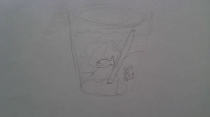
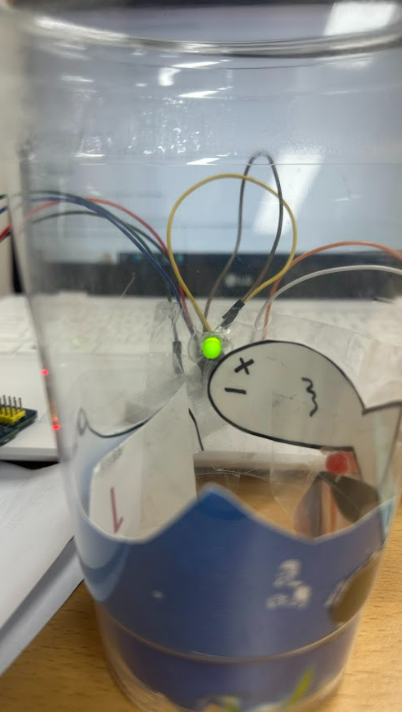

# eco-art-project# 🌱 에코아트 프로젝트: []

## 📖 프로젝트 개요
- **제작자**:20728 최민영
- **제작일**:2025.07.16
- **소개**
>바다에 가면 아무렇지 않게 버려진 쓰레기들이 많다.무심코 버린 쓰레기가 해양 생태계에 어떤 영향을 미치는지 알려주기 위해 만들었다.

## 📦 사용 재료
- 아두이노, 온도센서, LED, 브레드보드
- 페트병, 그림 도안, 달력, 네임펜

## 🔧 제작 과정
파란색이 추가 되어있는 종이를 활용하여 파도 모양처럼 오리고 종이에 물고기를 그린다.
### 1단계: 아이디어 스케치

- 아이디어 설명:우리가 무심코 버린 쓰레기들이 해양생태계에게 위협을 주어 물고기들이 죽는 것을 표현하였다.
- 예상 완성도:50%

### 2단계: 완성품

## 💭 제작 후기
### 잘된 점
- 물고기 주변에 LED조명을 설치하여 죽어가는 물고기를 표현한 것.

### 아쉬운 점
- 한 가지 재료로만 페트병 안을 바다로 꾸민거라 높은 완성도로 좋은 작품을 만들지 못 한 것 같다.

### 개선할 점
- 좀 더 정성 들여 만들고 쓰레기를 더 추가하여 심각한 환경 문제를 보여주면 좋을 것 같다.
### 내가 이미 알고 있었던 것
- 평소 바다를 가면 모래사장에 아무렇지 않게 버려진 쓰레기들을 본 적이 있고 예전에 학교 수업에서도 여러차례 해양생태계 문제를 본 적이 있다.

### 새롭게 배운게 된 것
- 아두이노가 무엇인지 어떻게 사용되는지 알게 되었다.

### 더 알고 싶은 것
- 심각한 환경문제에 대해 알아보고 싶다.

## 🌍 환경적 의미
- 바닷속 쓰레기 문제를 시각적으로 보여주어 심각성을 심어준다.
- 앞으로의 환경 보호 다짐:쓰레기를 분리배출하고 플라스틱 컵을 챙기기보단 개인 텀블러를 챙겨다녀야 겠단 생각이 들었다.

## 📚 참고 자료
- 환경운동 연합[해양] 해양생태계를 파괴하는 악영향 (https://kfem.or.kr/ocean/?bmode=view&idx=17912536)

## 🏷️ 태그
#에코아트 #재활용 #환경보호 #DIY #창의활동 #바닷속 #해양문제 #물고기 

---

> 이 프로젝트는 환경 보호와 창의적 사고를 위한 교육 목적으로 제작되었습니다.
